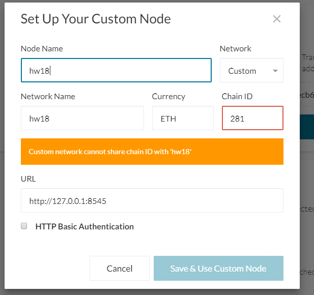
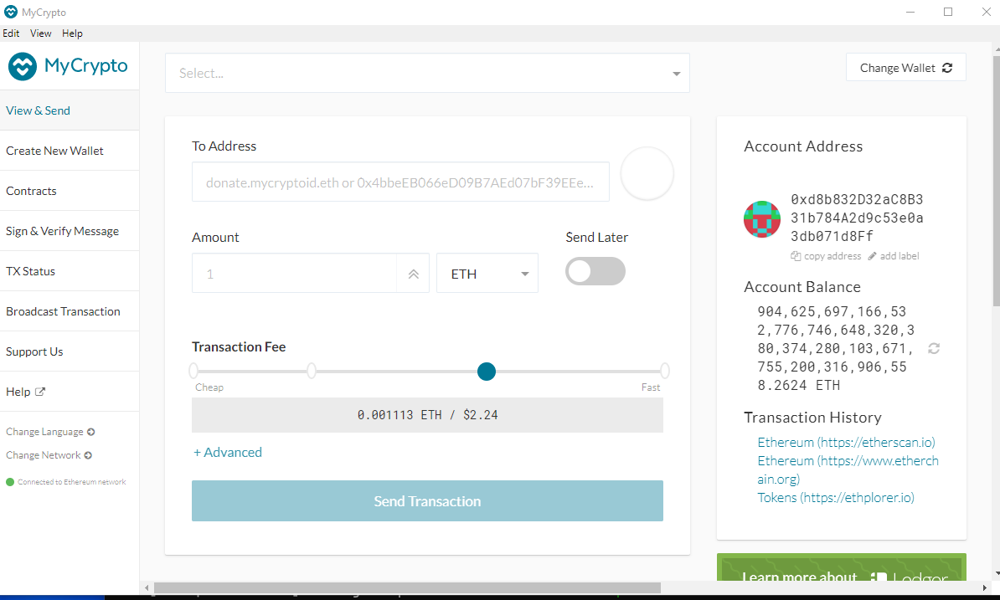

# HW 18 - Proof of Authority Blockchain
To set up a testnet, first we need to setup some nodes using Geth.  For this setup, Geth is installed in a sister directory called "blockchain_tools".
### Node Configuration
First, we create 2 nodes using geth.  Those commands are:

> ../blockchain-tools/geth --datadir node1 account new  
> ../blockchain-tools/geth --datadir node2 account new

Running these commands will provide us public addresses of the nodes, as well as a file that has the private key.

For these nodes, the files are saved to the repository as:

* Node 1 : [./node1/keystore/UTC--2021-07-22T21-09-56.284893500Z--d8b832d32ac8b331b784a2d9c53e0a3db071d8ff](node1/keystore/UTC--2021-07-22T21-09-56.284893500Z--d8b832d32ac8b331b784a2d9c53e0a3db071d8ff)
* Node 2 : [./node2/keystore/UTC--2021-07-22T21-10-29.386343100Z--ad4d6b27d858bc0f355c5437c1b6d3f58c25b013](node2/keystore/UTC--2021-07-22T21-10-29.386343100Z--ad4d6b27d858bc0f355c5437c1b6d3f58c25b013)

Once the private keys are extracted, they need to be made secret. To help manage these files, I have stored them in the [keys.txt](keys.txt) file for easy referral.

### Blockchain Configuration
Once the nodes are created, we can now use Puppeth to setup our blockchain.
 > ../blockchain-tools/puppeth
 I have screenshots of the configuration as follows:  

This sets up a Proof of Authority blockchain using the 2 nodes we setup previously, and both nodes are allowed to approve any transactions.  Note that both nodes are pre-funded.

### Blockchain Startup
Now that the blockchain is created, we need to start it up.  We will need 2 terminals, as the blockchains will run continuously in the foreground.  

For the first node, run:
> ../blockchain-tools/geth --datadir node1 --unlock "0xd8b832d32ac8b331b784a2d9c53e0a3db071d8ff" --mine --rpc --allow-insecure-unlock

This will start up a mining node as follows:

We need to copy the enode from this mining block as   
* enode://e1139601f27b942205a425d8c222a45d30fd10f6dbcc5c910d040e804d2ea6729d3373e4db99573b7675723349dc520d2ba1ec3cf5b1c963cd30e64ea3accec3@68.170.95.241:30303  

We can then run the 2nd node in another terminal:

> ../blockchain-tools/geth --datadir node2 --unlock "0xad4d6b27d858bc0f355c5437c1b6d3f58c25b013" --mine --port 30304 --bootnodes "enode://e1139601f27b942205a425d8c222a45d30fd10f6dbcc5c910d040e804d2ea6729d3373e4db99573b7675723349dc520d2ba1ec3cf5b1c963cd30e64ea3accec3@68.170.95.241:30303" --ipcdisable --allow-insecure-unlock

This will start up a second node as follows:

The blockchain is up and running!

### Performing Transactions

Open MyCrypto and add a custom node to connect to the blockchain.  Use the parameters in the screenshot below:

Once that is done, click "Back" and then "Generate a Wallet" to create an empty wallet where we can send new Ethereum to.

For this wallet, I used a password _gnindfhafhafadf_ , which we can use to open the wallet later to check if Eth has been transferred.  This wallet has public address "0x039e57c33d123f4c17a3a16dfcc30c8c15c815eb"

Now, to send Ethereum, click on "View & Send" and then "Keystore File".

Click on the Node1 keystore file we created at the beginning.  The password I used was "node1".

This will open the wallet as :

You can see that Node 1 has an extremely large Ethereum balance.

To send Ethereum to our empty wallet, simply fill in the wallet address, an amount, and then max out the fee as follows:

Once you click on "Send Transaction", MyCrypto will ask to confirm:

Click on "Send", and MyCrypto will show a green confirmation screen.  You can check the status of the transaction by clicking on "TX Status" and selecting the hash of this transaction, which will show "Pending"

As soon as the blockchain mines and approves the block, this transaction will be confirmed.
